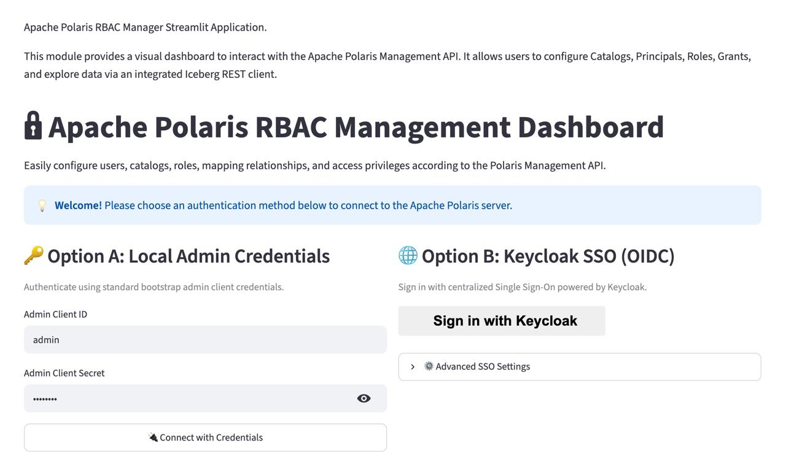
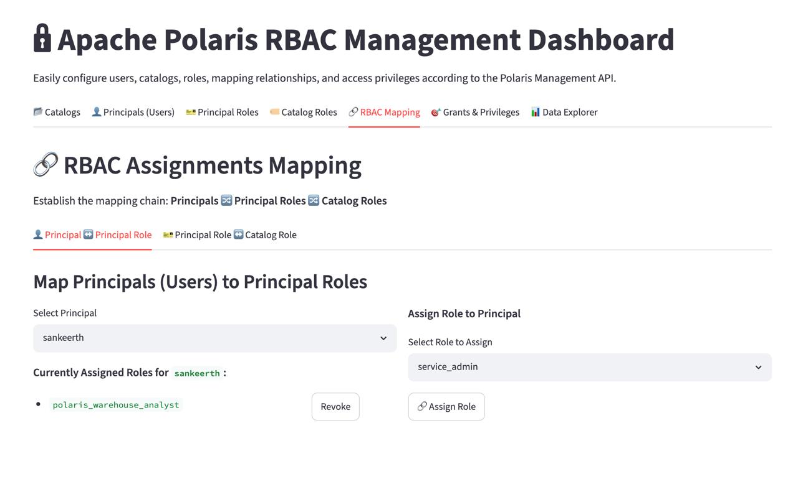
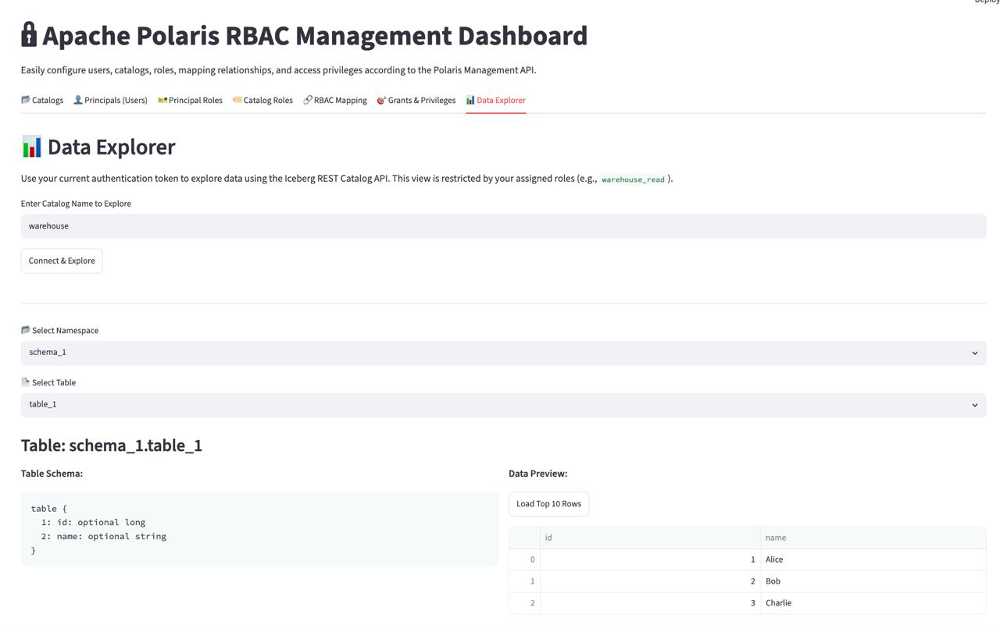
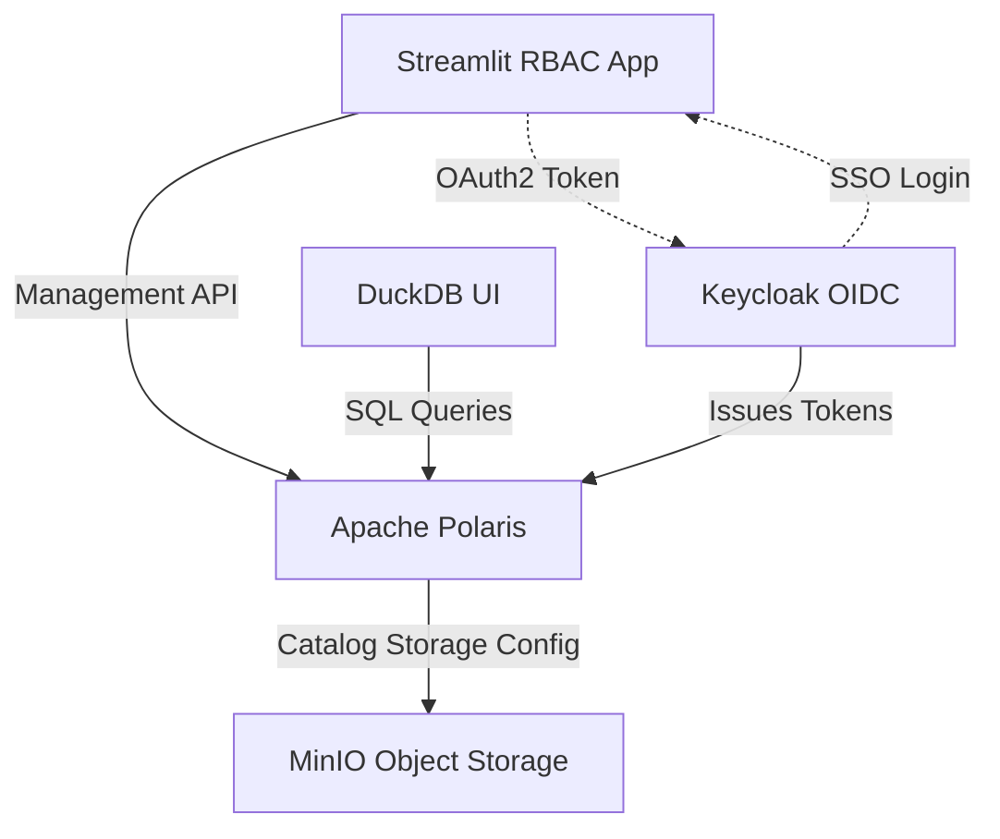

# Apache Polaris RBAC & SSO Manager

This project provides a comprehensive, local Lakehouse environment featuring **Apache Polaris**, which serves as the catalog for Apache Iceberg. The project integrates Apache Polaris, MinIO, and Keycloak (for Single Sign-On via OIDC), using DuckDB as a SQL engine/editor and a Streamlit-based UI for RBAC management.

## 🌟 Key Features

- **Streamlit RBAC Manager**: A full UI dashboard to seamlessly configure Polaris Catalogs, Principals (Users), Roles, and Privileges without using raw REST APIs.
- **Keycloak Integration**: OpenID Connect (OIDC) SSO integration for Polaris, allowing centralized identity and group management.
- **Local Lakehouse Stack**: Docker-compose setup spinning up Polaris, MinIO, and Keycloak instantly.
- **Polaris Bootstrapping**: Automated scripts to initialize the catalog and verify end-to-end data lakehouse permissions.

## 🖼️ UI Gallery


<br>*SSO Login via Keycloak*


<br>*Managing Polaris Principals, Roles, and Grants*


<br>*Querying Data directly within the Streamlit UI*

## 🏗️ Architecture



## 🚀 Quickstart Guide

### 1. Prerequisites
- Docker & Docker Compose
- Python 3.9+

### 2. Python Environment Setup
Before running the setup script, activate your virtual environment and install the required dependencies:

```bash
python -m venv .venv
source .venv/bin/activate
pip install -r requirements.txt
```

#### (Optional) Environment Variables
The automated setup and UI are fully plug-and-play and will run using default local passwords. If you wish to test custom credentials (e.g., Keycloak or Polaris administrator passwords), you can optionally configure them by copying the provided template:
```bash
cp .env.example .env
```

### 3. Automated Setup
We have provided an all-in-one setup script that will:
1. Spin up the Docker containers (Polaris, Keycloak, MinIO).
2. Configure Keycloak with a test user (`sankeerth`). See [Keycloak UI Setup](docs/keycloak_ui_setup.md) for manual setup instructions.
3. Bootstrap your first Polaris Iceberg Catalog.
4. Automatically configure Polaris RBAC (Principals, Roles, and Grants) using the Python API client.
5. Verify end-to-end access using OIDC SSO.

```bash
./scripts/run_setup.sh
```

### 4. Launch the RBAC Manager UI
Once the automated setup completes, launch the Streamlit app to explore your catalog and test RBAC permissions:

```bash
streamlit run app/main.py
```

> ### 💡 Note: Local S3 & SSO Hostname Resolution (Required for Data Explorer)
> 
> When you use the **Data Explorer** tab in the Streamlit app to query tables, the app asks Polaris for the table metadata. Polaris responds with the table location (`s3://warehouse/...`) and instructs the client to use the S3 endpoint `http://minio:9000`.
>
> Because your Streamlit application runs directly on your host machine (outside of Docker), your operating system needs to know how to resolve the container hostnames (`minio` and `keycloak`) to fetch the parquet files and perform authentication check redirects.
>
> For **macOS/Linux**, open your terminal and run:
> ```bash
> sudo nano /etc/hosts
> ```
> For **Windows**, open your terminal as Administrator and run:
> ```bash
> notepad C:\Windows\System32\drivers\etc\hosts
> ```
> Add the following line to the bottom of the file:
> ```text
> 127.0.0.1   minio keycloak
> ```

## 📂 Project Structure

- `app/`: Streamlit UI and Polaris API Client.
- `scripts/`: Bootstrap scripts for Keycloak, Polaris, and Lakehouse testing.
- `docker-compose.yml`: Local infrastructure definitions.

## 🎓 Background & Motivation

This project started by experimenting with the excellent [Apache-Polaris-Apache-Iceberg-Minio-Spark-Quickstart](https://github.com/AlexMercedCoder/Apache-Polaris-Apache-Iceberg-Minio-Spark-Quickstart) by Alex Merced. 

While learning about the Apache Polaris catalog, I wanted to deeply understand how its Role-Based Access Control (RBAC) model works—specifically how Principals, Principal Roles, Catalog Roles, and Grants map to one another. Because Polaris is quite new, I couldn't find an open-source UI that neatly organized these concepts in one place. 

To solve this, I built a custom **Streamlit application** to visually manage these permissions. As the project grew, I wanted to explore how enterprise deployments handle identity. I integrated **Keycloak** to simulate an Okta-style OIDC (OAuth) Single Sign-On (SSO) workflow. 

Ultimately, this project serves as a proof-of-concept for building an open-source alternative to Snowflake's architecture. It provides:
- A Keycloak backend for Okta-like user management.
- A Streamlit UI for catalog admins to manage RBAC.
- A Data Explorer tab for data engineers and analysts to verify their permissions.
- A sample DuckDB script (`scripts/duckdb_polaris_example.sql`) demonstrating how to query and interact with the local Polaris catalog, MinIO, and Iceberg tables.

It is provided as-is, but feel free to explore the code and use it as a reference for your own data lakehouse setups!

> ### 💡 Note:
> The architectural design, OIDC mapping configurations, and Quarkus group role integrations implemented in this repository are based on the detailed research findings compiled in: `docs/polaris_oidc_rbac_findings.md`

## 📄 License

This project is licensed under the MIT License - see the [LICENSE](LICENSE) file for details.